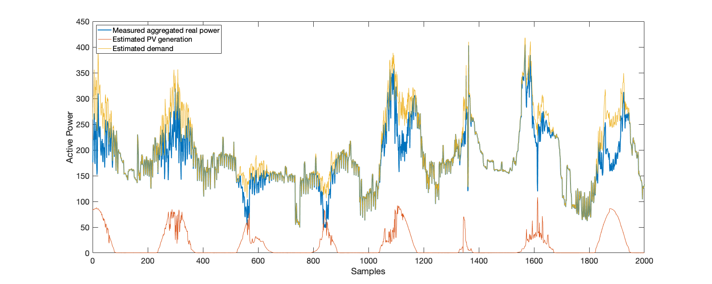

Method C
========
Disaggregation of photovoltaic production from composite power flow measurements
--------------------------------------------------------------------------------

Provided with measurements of the aggregated real power (e.g., power distribution network, a building) and global horizontal irradiance (e.g., from a pyranometer), this code estimates the amount of (unobserved) PV generation within that aggregation with Method C from [1].

This method was proven to still work with (less resolved) satellite irradiance estimations, which may be easier to access than pyranometer measurements, see [2], even if with a deterioration of the performance. This code uses the PVLIB toolbox for MATLAB [3], and S2-Sampling-Toolbox [4].

The measurements provided in this code are from the "dispatchable feeder" setup [5]. It is a medium voltage distribution feeder of the EPFL campus interfacing office buildings (peak demand approx. 400 kW) with roof-top PV generation (around 95 kWp, at the time of these measurements).

References
----------

[1] F. Sossan, L. Nespoli, V. Medici and M. Paolone, "Unsupervised Disaggregation of PhotoVoltaic Production from Composite Power Flow Measurements of Heterogeneous Prosumers," in IEEE Transactions on Industrial Informatics. doi: 10.1109/TII.2018.2791932, 2019. https://arxiv.org/pdf/1706.04821.pdf

[2] F. Sossan, E. Scolari, M. Paolone, "Disaggregation of Local Photovoltaic Generation from Composite Power Flows with Direct Measuring and Satellite Estimations of the Irradiance: a Comparison", EUPVSEC, 2019. https://cutt.ly/Gh19wrV

[3] Stein, Joshua S., et al. "PVLIB: Open source photovoltaic performance modeling functions for Matlab and Python." 2016 IEEE 43rd photovoltaic specialists conference (PVSC). IEEE, 2016.

[4] Anton Semechko, https://github.com/AntonSemechko/S2-Sampling-Toolbox

[5] F. Sossan F., E. Namor, R. Cherkaoui, and M. Paolone, ". "Achieving the dispatchability of distribution feeders through prosumers data driven forecasting and model predictive control of electrochemical storage," in IEEE Transactions on Sustainable Energy, 7(4), 1762-1777, 2016. https://arxiv.org/abs/1602.02265
